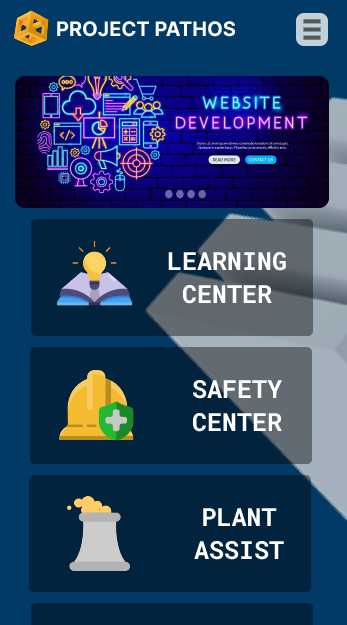

# Project Naor

## Back Drop

Project Naor is one of my (Christopher Hayden) major programming projects geared towards meeting the needs
of current day plant/factory operators, managers, technicians and even administrators. The features integrated
into this application are diverse and aim at testing and challenging my programming skills. This project is obviously
a means to grow and develop myself in the discipline of software engineering.

My end game is to roll out with a base modle of this application that will comprise of some basic features, to be
discussed later, free to all plant/ factory operators. The later versions of the application will consist of deeper
and even possible specific paid features that will be sold to plants/ factories seeking a more tailored or advanced
application to meet their plants operating, awarenss and managing needs.

The name Naor is of Hebrew origin and means "Enlightened". Definetly this development process has and will continue to be an
enlightening stage of my life. I have come to the realization that being a self taught developer really does take a lot of
consistency, discipline and focus, characteristics that I thought I had pat down but have proven to be quite the opposite.
SO besides my enlightenment of knowledge I have definetly been enlightened more about my weaknesses through this process.

With all that said my codes might not paint the picture of a perfect developer but more of one who is learning and finding
his way through this densely canopied forest of software engineering.

<!-- {:height: 200vw style="margin-left: auto, margin-right: auto"} -->

# 1.0 Front End Development (12/06/2023)

For the front end of this application my initial plan was to utalize the React Library. The issue I have however with this is that
I am not that verse with the functionalities of Java Script. Hence the current goal is to utalize basic front end development using
html,css and Java Script. Once I have develop a major level of confidence in using Java Script, I will then branch over into
integrating React Library into my front end development.

## 1.1 Designing the Application Interface

<!-- { height=200 style="margin-left: auto; margin-right: auto"} -->

My first attempt to this application was called Project Pathos. I have changed this project's name to Naor currently. Inclusive of the
name I am planning on changing the general apperance of the application to give it a more professional and industrial look mixed with a
touch of technology.
